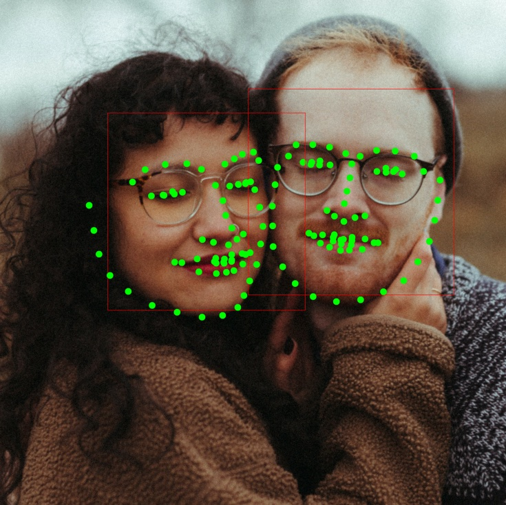

# facelandmark-keras
Face Landmarks Detection using Keras-Tensorflow

  
<span>Sample Photo by <a href="https://unsplash.com/@joanna_nix?utm_source=unsplash&amp;utm_medium=referral&amp;utm_content=creditCopyText">Joanna Nix-Walkup</a> on <a href="https://unsplash.com/t/people?utm_source=unsplash&amp;utm_medium=referral&amp;utm_content=creditCopyText">Unsplash</a></span>

## Prerequisites
* tensorflow (2.x)
* opencv-python
* matplotlib
* tqdm

## Dataset Preparation
I used official [DLib dataset](http://dlib.net/files/data/ibug_300W_large_face_landmark_dataset.tar.gz) to train model.  
If you want to use this dataset, download and extract file somewhere and run [prepare.py](./prepare.py) before training.

```
$ python prepare.py <dataset directory>
```

## Data Augmentation
For data augmentation, DataGenerator class is implemented in [datagenerator.py]('./datagenerator.py')

DataGenerator is enabled by default but if you want to disable it, change __use_generator = True__ to False which is defined in [train.py](./train.py).  
DataGenerator randomly change rotation angle (0-45 deg) and scale (1.0-0.7).

## Training
Model is defined in [network.py](./network.py). I used MobileNetV2 as a base network and added 3 convolution layers followed by MobileNetV2's block 8.

There are many examples that placing fully connected layer into last to predict landmarks, but I designed it to consist only of convolution layers. As a result of testing both cases(FC vs. CNN as a last layer), there was no change in the number of parameters, but in the case of convolution layers only, the performance was slightly better.

Regarding loss function, I used Mean Squared Error.

Pretrained model is already available in _model/network.h5_. You can skip this phase if you want to check live webcam application first.

To train this model, run
```
$ python train.py
```
Following parameters are defined by default
* batch_size: 16
* Adam optimizer with amsgrad
* Learning rate: 1e-3 for 50000 iter, 2e-4 for 40000 iter and 1e-4 for 30000 iter

Unfortunately, after model.fit is finished, memory was not cleared properly so that when model.fit called 2nd times, system raises 'memory not enough error' and terminated forcibly in CoLab free tier environment.

Thus, to train with dynamic learning rate by iterations, you need to run train.py multiple times. _If you know how to cleanup the memory properly after model.fit, please let me know!_

After training is done, model will be saved under _model/network.h5_.

## Application
To test with live webcam application, run
```
$ python app.py
```

This app uses a __Harr Cascade Classifier__ provided by OpenCV to detect faces. This face detector requires pre-trained xml data for classifiers. The app will automatically download the default xml file when you run the app.

## Future Works
Increase accuracy with following methods:
* Test with different base model (e.g. darknet?)
* Apply various loss function
* More datasets

Reduce network size
